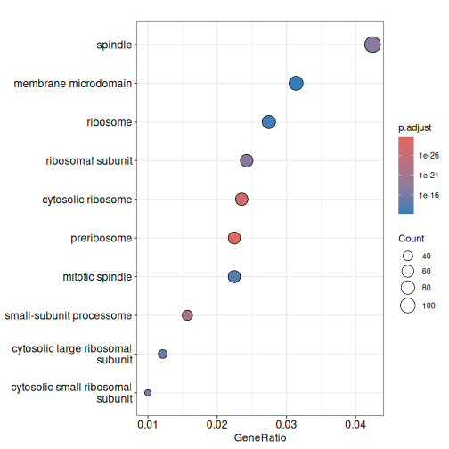
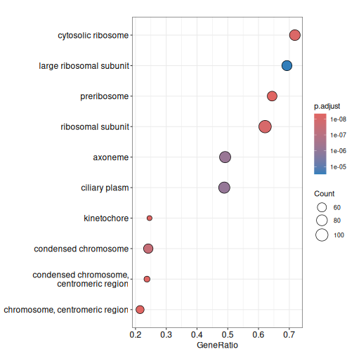
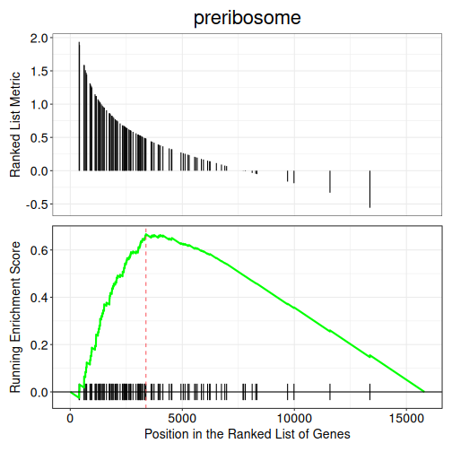

:::::::::::::::::::::::::::::::::::::: questions 

- What are the different types of GO terms (BP, MF, CC)?
- How do we perform ORA using `enrichGO()` function?
-	How can we run GSEA-style functional class scoring with `gseGO()` function?


::::::::::::::::::::::::::::::::::::::::::::::::

::::::::::::::::::::::::::::::::::::: objectives

- Apply GO-based enrichment methods using `clusterProfiler`
- Perform both ORA and GSEA using the GO terms database
- Build confidence in navigating GO resources and interpreting enriched terms 

::::::::::::::::::::::::::::::::::::::::::::::::

## Introduction

The Gene Ontology (GO) project is a major bioinformatics initiative that standardises how we describe gene functions across species, organising them into three categories: Biological Process, Molecular Function and Cellular Component. `clusterProfiler` is an R package that allows us to test whether these GO terms are associated with our RNA-seq results and gain insight into the pathways or functions represented in our data. This section demonstrates how to perform both **over-representation analysis (ORA)** and **functional class scoring (FCS)** with GO database, depending on whether you are working with a list of significant genes or full ranked expression data. 

## Over-Representation Analysis (ORA)

**ORA** tests whether a list of significant genes are linked to specific GO terms. The input is a vector of gene IDs (or list of genes) that passes your differential expression cut-off. ORA can be run separately for downregulated and upregulated genes to reveal which GO terms are enriched in each direction.

We first subset the `debasal` dataset to extract genes with adjusted p-value below 0.01 and store this set of significant genes in an object called `genes`. We then run enrichGO function using this gene list, specifying the organism database `org.Mm.eg.db`, the identifier type `ENTREZID` and the GO category of interest `CC` (for cellular component). The function is configured with standard p-value and q-value, using Benjamini-Hochberg correction. We use the function `head()` to check the first few lines of output. 


``` r
debasal$Status <- debasal$adj.P.Val < 0.01
gene <- debasal$ENTREZID[debasal$Status]

ego <- enrichGO(gene = gene,
                OrgDb = org.Mm.eg.db,
                keyType = 'ENTREZID',
                ont = "CC",
                pAdjustMethod = "BH",
                pvalueCutoff = 0.01,
                qvalueCutoff = 0.05,
                readable = TRUE)
head(ego)
```

``` output
                   ID                       Description GeneRatio   BgRatio
GO:0030684 GO:0030684                       preribosome   63/2804 105/25804
GO:0022626 GO:0022626                cytosolic ribosome   66/2804 124/25804
GO:0032040 GO:0032040          small-subunit processome   44/2804  73/25804
GO:0005819 GO:0005819                           spindle  119/2804 450/25804
GO:0044391 GO:0044391                 ribosomal subunit   68/2804 185/25804
GO:0022627 GO:0022627 cytosolic small ribosomal subunit   28/2804  38/25804
           RichFactor FoldEnrichment   zScore       pvalue     p.adjust
GO:0030684  0.6000000       5.521541 16.21001 3.722343e-34 2.810369e-31
GO:0022626  0.5322581       4.898141 15.19256 2.316529e-31 8.744898e-29
GO:0032040  0.6027397       5.546753 13.58297 2.200476e-24 5.537865e-22
GO:0005819  0.2644444       2.433568 10.71178 1.051630e-20 1.984952e-18
GO:0044391  0.3675676       3.382565 11.35559 1.354371e-20 2.045101e-18
GO:0022627  0.7368421       6.780839 12.45143 1.432799e-19 1.802938e-17
                 qvalue
GO:0030684 1.754661e-31
GO:0022626 5.459899e-29
GO:0032040 3.457580e-22
GO:0005819 1.239309e-18
GO:0044391 1.276864e-18
GO:0022627 1.125669e-17
                                                                                                                                                                                                                                                                                                                                                                                                                                                                                                                                                                                                                                                                                                                                                                          geneID
GO:0030684                                                                                                                                                                                                                                                                                                                                                                                   Wdr36/Rps17/Pes1/Utp14b/Mak16/Rps11/Pno1/Krr1/Tsr1/Bysl/Riok2/Rcl1/Utp18/Dimt1/Wdr74/Wdr43/Nop14/Fbl/Rps19/Ppan/Ebna1bp2/Rps5/Nat10/Rps23/Srfbp1/Nol6/Nip7/Rps4x/Noc2l/Tbl3/Rps8/Rps7/Rps16/Rps27a/Pwp2/Ftsj3/Noc4l/Wdr46/Rps15a/Utp15/Riok1/Mrto4/Rps14/Rps9/Rps3a1/Wdr75/Rps24/Utp4/Rrp15/Rps28/Heatr1/Nop56/Prkdc/Dhx37/Mphosph10/Rrp1b/Ltv1/Rrs1/Rps12/Rps19bp1/Rrp9/Nob1/Utp25
GO:0022626                                                                                                                                                                                                                                                                                                                                                             Rps15/Rpl5/Rpl36/Rps21/Rps17/Rpl19/Rps2/Usp10/Rpl18/Rps11/Rpl11/Gspt1/Rps20/Rpl12/Rpl13a/Rplp0/Rps26/Rplp2/Rpl10a/Rpl26/Rpl31/Rpl14/Rps19/Rps5/Rps10/Rpl7a/Rps23/Rpl4/Rpl22/Rpl36a/Rps4x/Rpl23/Rps8/Rps7/Rpl41/Rpl10/Rps16/Rps27a/Rpl8/Rpl32/Etf1/Rps15a/Rpl24/Rpl21/Rpl27/Rps14/Rpsa/Rps9/Rps3a1/Ppargc1a/Rplp1/Rpl35/Rps3/Rpl23a/Rps24/Rps18/Rps28/Rps25/Rpl18a/Rpl34/Rpl3/Rpl15/Rps12/Abce1/Rps29/Rpl6
GO:0032040                                                                                                                                                                                                                                                                                                                                                                                                                                                                                                 Wdr36/Rps17/Utp14b/Rps11/Pno1/Krr1/Rcl1/Utp18/Dimt1/Wdr43/Nop14/Fbl/Rps19/Rps5/Nat10/Rps23/Nol6/Rps4x/Tbl3/Rps8/Rps7/Rps16/Rps27a/Pwp2/Noc4l/Wdr46/Rps15a/Utp15/Rps14/Rps9/Rps3a1/Wdr75/Rps24/Utp4/Rps28/Heatr1/Nop56/Prkdc/Dhx37/Mphosph10/Rps12/Rps19bp1/Rrp9/Utp25
GO:0005819 Luzp1/Gem/Cenpf/Wdr5/Mapre3/Haus4/Kmt5b/Lzts2/Ccnb1/Birc5/Ncor1/Prpf19/Hmmr/Map4/Nsun2/Kifc1/Kntc1/Cdc20/Cltc/Dctn1/Cdk1/Shcbp1/Ctdp1/Cspp1/Mad2l1/Spdl1/Ccsap/Kif15/Dpysl2/Hecw2/Spice1/Afg2a/Kif22/Cdc27/Ckap5/Cep170/Invs/Anxa11/Nedd9/Nusap1/Adrb2/Tppp/Ckap2/Gpsm2/Gsk3b/Parp4/Csnk1d/Racgap1/Kif20a/Rassf10/Prc1/Cdca8/Plk1/Ercc2/Tmem201/Cenpe/Npm1/Ino80/Clasp2/Tubb2a/Dlgap5/Mapk14/Rangap1/Tbccd1/Sgo1/Ccdc66/Topors/Ect2/Ralbp1/Eml4/Ska1/Arl8a/Git1/Tpx2/Cep63/Knstrn/Champ1/Zzz3/Kif18b/Fam110a/Ikbkg/Pmf1/Nup62/Kif23/Nek6/Unc119/Dzip1l/Cdk5rap2/Bub1b/Rcc2/Spag5/Diaph3/Rps3/Hnrnpu/Sirt2/Kif11/Chmp3/Kat2b/Ckap2l/Kif2a/Hspa2/Cep350/Rps6ka2/Clasp1/Pard3/Espl1/Nek7/Ppp2cb/Mical3/Tbl1x/Slc25a5/Plekhg6/Mtcl1/Aurkb/Arhgef2/Kif2c/Kif14/Ddx11/Tacc3
GO:0044391                                                                                                                                                                                                                                                                                                                                              Rps15/Rpl5/Rpl36/Rps21/Rack1/Rps17/Rpl19/Rps2/Rpl18/Rps11/Rpl11/Rps20/Rpl12/Rpl13a/Rplp0/Rps26/Mrpl17/Rplp2/Rpl10a/Rpl26/Rpl31/Rpl14/Rps19/Rps5/Rps10/Rpl7a/Rps23/Rpl4/Rpl22/Rpl36a/Npm1/Rps4x/Rpl23/Rps8/mt-Rnr2/Rps7/Rpl41/Rpl10/Rps16/Rps27a/Rpl8/Rpl32/Rps15a/Rpl24/Rpl21/Rpl27/Rps14/Rpsa/Rps9/Mrpl12/Rps3a1/Rplp1/Rpl35/Rps3/Mrpl52/Rpl23a/Rps24/Rps18/Rps28/Rps25/Rpl18a/Rpl34/Rpl3/Rpl15/Rps12/Mrps30/Rps29/Rpl6
GO:0022627                                                                                                                                                                                                                                                                                                                                                                                                                                                                                                                                                                                                   Rps15/Rps21/Rps17/Rps2/Rps11/Rps20/Rps26/Rps19/Rps5/Rps10/Rps23/Rps4x/Rps8/Rps7/Rps16/Rps27a/Rps15a/Rps14/Rpsa/Rps9/Rps3a1/Rps3/Rps24/Rps18/Rps28/Rps25/Rps12/Rps29
           Count
GO:0030684    63
GO:0022626    66
GO:0032040    44
GO:0005819   119
GO:0044391    68
GO:0022627    28
```

We can then use `dotplot()` function to visualise the results in the form of a dot plot. From the plot below, we can see that GO term cellular component spindle, membrane microdomain and ribosome are top enriched terms.


``` r
dotplot(ego)
```



::::: challenge

Challenge! Can you identify enriched GO term biological process in `deluminal` dataset? Are the enriched pathways similar?

:::::
## Gene Set Enrichment Analysis (GSEA)

We can also perform **GSEA** using GO database. GSEA is a type of functional class scoring method that evaluates whether genes belonging to a GO term tend to appear at the top or bottom of a ranked gene list, rather than relying on a cut-off (i.e. adj.P.Val < 0.01). The input is a continuous ranking metric (e.g. log2FC) for all genes. This allows the detection of subtle but coordinated shifts in GO terms for both downregulated and upregulated pathways. 

We begin by creating a ranked gene list for GSEA by extracting the logFC values from `debasal` dataset and its corresponding `ENTREZID`. We then sort this vector in a decreasing order so that the upregulated genes appear at the top of the list and the downregulated genes at the bottom. Using this ranked gene list, we run `gseGO()` to perform GSEA on GO terms `CC`, by specifying the organism database, gene ID type, gene set limits and p-value cut-off for enrichment. 


``` r
debasal_genelist <- debasal$logFC
names(debasal_genelist) <- debasal$ENTREZID
debasal_genelist <- sort(debasal_genelist, decreasing = TRUE)

ego3 <- gseGO(gene          = debasal_genelist,
                OrgDb         = org.Mm.eg.db,
                keyType       = 'ENTREZID',
                ont           = "CC",
              minGSSize    = 100,
              maxGSSize    = 500,
              pvalueCutoff = 0.05,
              verbose      = FALSE)
head(ego3)
```

``` output
                   ID                              Description setSize
GO:0030684 GO:0030684                              preribosome     104
GO:0022626 GO:0022626                       cytosolic ribosome     110
GO:0000776 GO:0000776                              kinetochore     167
GO:0000779 GO:0000779 condensed chromosome, centromeric region     177
GO:0044391 GO:0044391                        ribosomal subunit     169
GO:0000775 GO:0000775           chromosome, centromeric region     242
           enrichmentScore      NES       pvalue     p.adjust       qvalue rank
GO:0030684       0.6665752 2.403534 1.000000e-10 4.625000e-09 4.625000e-09 3377
GO:0022626       0.6280927 2.259154 1.898297e-10 7.023700e-09 7.023700e-09 4038
GO:0000776       0.5753751 2.189832 1.000000e-10 4.625000e-09 4.625000e-09 1254
GO:0000779       0.5636384 2.158333 1.000000e-10 4.625000e-09 4.625000e-09 1254
GO:0044391       0.5552514 2.108983 2.988331e-10 9.214021e-09 9.214021e-09 4724
GO:0000775       0.5286434 2.075855 1.000000e-10 4.625000e-09 4.625000e-09 1417
                             leading_edge
GO:0030684 tags=64%, list=21%, signal=51%
GO:0022626 tags=72%, list=26%, signal=54%
GO:0000776  tags=25%, list=8%, signal=23%
GO:0000779  tags=24%, list=8%, signal=22%
GO:0044391 tags=62%, list=30%, signal=44%
GO:0000775  tags=21%, list=9%, signal=20%
                                                                                                                                                                                                                                                                                                                                                                                                                                                                                                                                                                                                                                                                core_enrichment
GO:0030684                                                                                                                                                                                                                                    72515/59028/14113/235036/67223/72462/104662/215193/59014/67973/67619/98956/27966/217995/56095/57741/67222/69902/66538/67134/213773/21771/105372/66164/53414/67920/78294/71340/208144/57750/107071/20085/110816/57315/52705/230082/20055/20115/20116/217109/20103/20088/64934/66249/68052/66254/100608/54127/20091/67045/20042/73674/353258/20068/76846/72554/267019/20102/20044/27207/69072/195434/225348/14791/57294/66475/27993
GO:0022626                                                                                                                                                              16785/56040/269261/22224/20084/19982/68436/22186/78294/67186/67097/20085/67671/20055/19951/11837/100503670/20115/27367/20116/54217/27370/76808/20103/270106/268449/20088/19896/67025/68052/20090/75617/24015/20054/27050/54127/26961/67115/67891/67945/114641/22121/19946/20091/19899/20042/66489/67427/66480/66481/65019/19921/20068/19988/19933/76846/267019/20102/20044/27207/19981/19942/14852/19941/57294/66475/19944/225363/27176/57808/16898/19934/110954/68193/11815/67281/207214/105083/319195
GO:0000776                                                                                                                                                                                                                                                                                                                                                                                                       20877/12235/66468/66977/66570/108000/67629/12236/76464/208628/26886/12615/268697/18817/102920/54141/67052/18005/60411/107995/72415/68549/70385/22137/11799/73804/51944/72155/229841/381318/71876/68014/67177/56150/69928/66934/66442/67037/19387/101994/236930
GO:0000779                                                                                                                                                                                                                                                                                                                                                                                                 20877/12235/66468/66977/54392/66570/108000/67629/12236/76464/208628/26886/12615/268697/18817/102920/54141/67052/18005/60411/107995/72415/68549/70385/22137/11799/73804/51944/72155/229841/381318/71876/68014/67177/56150/69928/66934/66442/67037/19387/101994/236930
GO:0044391 16785/56040/269261/20084/56282/19982/66973/68436/22186/78294/67186/67097/20085/67671/20055/18148/19951/11837/100503670/20115/14694/68836/27367/20116/54217/27370/76808/20103/270106/268449/20088/19896/67025/68052/20090/75617/69163/20054/27050/54127/26961/67115/67891/67945/114641/22121/19946/20091/19899/20042/66489/59054/67427/60441/66480/66481/65019/19921/27397/20068/118451/19988/19933/76846/267019/79044/20102/20044/27207/78523/19981/19942/66230/19941/57294/66475/19944/94063/27176/57808/16898/102060/66258/19934/110954/28028/68193/75398/67281/207214/319195/50529/26451/14109/19989/20104/64657/64655/66407/20005/94065/216767/67840/67308/19943
GO:0000775                                                                                                                                                                                                                                                                                                                                 20877/12235/66468/66977/54392/66570/108000/52276/67629/72107/12236/70645/76464/208628/26886/12615/71988/268697/18817/102920/54141/67052/18005/60411/217653/107995/72415/68549/70385/22137/11799/73804/51944/21973/72155/229841/381318/217578/71876/68014/67177/56150/17345/69928/66934/66442/67037/19387/101994/236930/218973/219114
             log2err
GO:0030684       NaN
GO:0022626 0.8266573
GO:0000776       NaN
GO:0000779       NaN
GO:0044391 0.8140358
GO:0000775       NaN
```

``` r
dotplot(ego3)
```



We can also use the `gseaplot()` function to visualise GSEA result for a specific gene set. In this example, we select the top-ranked enriched GO term (geneSetID = 1). The result-ing plot displays how genes contributing to the enrichment of this GO term are distributed in the ranked gene list. 


``` r
gseaplot(ego3, by = "all", title = ego3$Description[1], geneSetID = 1)
```




::::::::::::::::::::::::::::::::::::: keypoints 

- GO terms are divided into Biological Process (BP), Molecular Function (MF) and Cellular Component (CC), which can be analysed separately or together depending on the biological question.
- The `enrichGO()` and `gseGO()` functions in `clusterProfiler` allow users to perform **ORA** and **GSEA** using the GO database directly.
- GO testing results highlight gene sets or pathways that are overrepresented in your dataset, allowing interpretation of downregulated or upregulated genes.

::::::::::::::::::::::::::::::::::::::::::::::::

