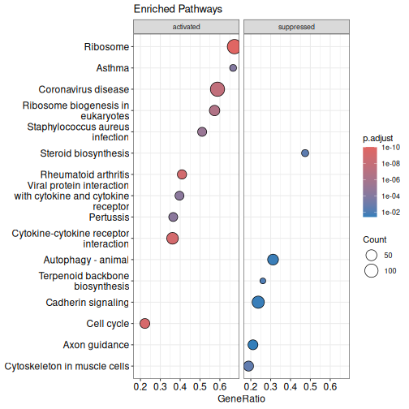
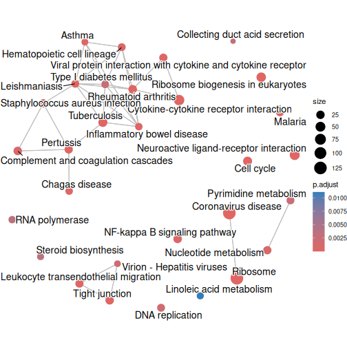
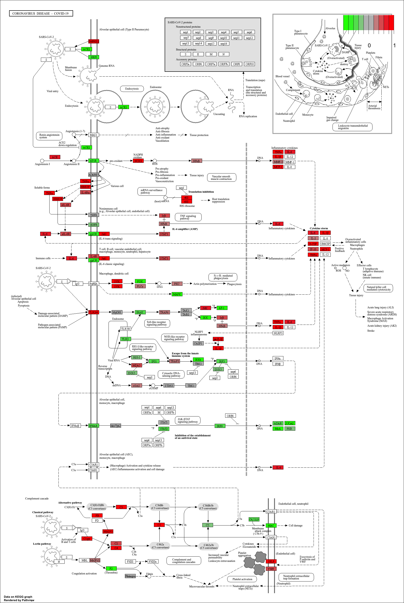

:::::::::::::::::::::::::::::::::::::: questions 

- How can we perform pathway analysis using KEGG?
- What insights can KEGG enrichment provide about differentially expressed genes

::::::::::::::::::::::::::::::::::::::::::::::::

::::::::::::::::::::::::::::::::::::: objectives

- Learn how to run KEGG over-representation and GSEA-style analysis in R.
- Understand how to interpret pathway-level results.
- Generate and visualise KEGG pathway figures.

::::::::::::::::::::::::::::::::::::::::::::::::


## Introduction
The KEGG (Kyoto Encyclopedia of Genes and Genomes) database links genes to curated biological pathways, offering a powerful foundation for understanding cellular functions at a systems level and making meaningful biological interpretations. `clusterProfiler` allows us to access KEGG and apply both ORA (using `enrichKEGG` function) and GSEA (using `gseKEGG` function) to extract pathway-level insights from our RNA-seq data.

## KEGG analysis

Before running enrichment, we need to confirm the correct KEGG organism code for mouse (`mmu`).
You can verify by searching:


``` r
kegg_organism <- "mmu"

search_kegg_organism(kegg_organism, by='kegg_code')
```

``` output
kegg_species.rda is not found, download it online...
```

``` output
     kegg_code               scientific_name                   common_name
29        mmur            Microcebus murinus              gray mouse lemur
34         mmu                  Mus musculus                   house mouse
9460      mmuc Mycolicibacterium mucogenicum Mycolicibacterium mucogenicum
```

## Over-representation analysis with `enrichKEGG`
To run ORA using KEGG database, we need to specify the gene list, KEGG organism code and p-value cut-off. In this example, we take the top 500 genes from the ranked gene list `debasal_genelist`, specify the organism code `mmu` (defined as `kegg_organism) and use 0.05 as the p-value cut-off.

We can use `head()` function to briefly inspect the results of `enrichKEGG`.


``` r
kk <- enrichKEGG(gene         = names(debasal_genelist)[1:500],
                 organism     = kegg_organism,
                 pvalueCutoff = 0.05)
```

``` output
Reading KEGG annotation online: "https://rest.kegg.jp/link/mmu/pathway"...
```

``` output
Reading KEGG annotation online: "https://rest.kegg.jp/list/pathway/mmu"...
```

``` output
kegg_category.rda is not found, download it online...
```

``` r
head(kk)
```

``` output
                                     category
mmu04110                   Cellular Processes
mmu04060 Environmental Information Processing
mmu05323                       Human Diseases
mmu04061 Environmental Information Processing
mmu04062                   Organismal Systems
mmu04914                   Organismal Systems
                                 subcategory       ID
mmu04110               Cell growth and death mmu04110
mmu04060 Signaling molecules and interaction mmu04060
mmu05323                      Immune disease mmu05323
mmu04061 Signaling molecules and interaction mmu04061
mmu04062                       Immune system mmu04062
mmu04914                    Endocrine system mmu04914
                                                           Description
mmu04110                                                    Cell cycle
mmu04060                        Cytokine-cytokine receptor interaction
mmu05323                                          Rheumatoid arthritis
mmu04061 Viral protein interaction with cytokine and cytokine receptor
mmu04062                                   Chemokine signaling pathway
mmu04914                       Progesterone-mediated oocyte maturation
         GeneRatio   BgRatio RichFactor FoldEnrichment   zScore       pvalue
mmu04110    19/249 157/11206 0.12101911       5.446346 8.457682 1.772195e-09
mmu04060    24/249 294/11206 0.08163265       3.673797 7.003413 3.642563e-08
mmu05323    13/249  87/11206 0.14942529       6.724738 8.080573 5.591458e-08
mmu04061    12/249  95/11206 0.12631579       5.684718 6.912393 1.186218e-06
mmu04062    16/249 194/11206 0.08247423       3.711671 5.743341 6.552072e-06
mmu04914    10/249  93/11206 0.10752688       4.839142 5.604279 3.922595e-05
             p.adjust       qvalue
mmu04110 5.015311e-07 3.706552e-07
mmu04060 5.154226e-06 3.809217e-06
mmu05323 5.274609e-06 3.898185e-06
mmu04061 8.392489e-05 6.202447e-05
mmu04062 3.708473e-04 2.740737e-04
mmu04914 1.850157e-03 1.367354e-03
                                                                                                                                                     geneID
mmu04110                               17215/268697/17219/105988/12235/434175/67849/71988/17218/18817/12428/67052/77011/12534/76464/20877/17216/12532/12236
mmu04060 230405/21926/20308/21948/21942/20309/16182/16181/20296/20297/20305/232983/17082/12985/20311/12978/20310/16878/77125/14563/330122/12977/18829/29820
mmu05323                                                                    22339/21926/68775/20296/20297/14960/14961/110935/20311/20310/15001/330122/12977
mmu04061                                                                           21926/20308/16182/20296/20297/20305/20311/12978/20310/330122/12977/18829
mmu04062                                                  20308/20309/18796/15162/20296/20297/20305/11513/22324/20311/20310/94176/432530/330122/18829/18751
mmu04914                                                                                    268697/110033/12235/434175/18817/12428/11513/12534/432530/12532
         Count
mmu04110    19
mmu04060    24
mmu05323    13
mmu04061    12
mmu04062    16
mmu04914    10
```

## GSEA-style KEGG enrichment with `gseKEGG`
Similar to previous enrichment analysis with GO database, we can also perform a GSEA-style enrichment using the KEGG database. To do so, we use the `gseKEGG` and specify the entire ranked gene list (`debasal_genelist`) rather than an arbitrary cutoff. In this example, we test KEGG pathways between 3 and 800 genes using 10,000 permutations and NCBI Gene IDs. Results are filtered using a p-value cut-off of 0.05.

``` r
kk2 <- gseKEGG(geneList     = debasal_genelist,
               organism     = kegg_organism,
               nPerm        = 10000,
               minGSSize    = 3,
               maxGSSize    = 800,
               pvalueCutoff = 0.05,
               pAdjustMethod = "none",
               keyType       = "ncbi-geneid")
```

``` output
Reading KEGG annotation online: "https://rest.kegg.jp/conv/ncbi-geneid/mmu"...
```

``` warning
Warning in prepare_gsea_inputs(geneList, scoreType, exponent): There are ties
in the preranked stats (0.98% of the list). The order of those tied genes will
be arbitrary, which may produce unexpected results.
```

``` warning
Warning in gsea(geneList = geneList, gene_sets = geneSets, weight = weight, :
For some pathways, in reality P-values are less than 1e-10. You can set the eps
argument to zero for better estimation.
```
## Visualising enriched pathways
### Dotplot
Before we look at individual pathways in detail, we can visualise the overall enrichment results using `dotplot()`.  
This dotplot summarises which KEGG pathways are enriched, how many genes contribute to each pathway, and how significant each one is.

``` r
dotplot(kk2, showCategory = 10, title = "Enriched Pathways" , split=".sign") + facet_grid(.~.sign)
```


### Similarity-based network plots
Next, we can explore how the enriched pathways relate to one another.  
The enrichment map groups pathways that share many genes, helping us see broader biological themes rather than isolated pathways.
In this case, `pairwise_termsim()` function calculates the similarity between enriched KEGG pathways and produces a similarity matrix that quantifies their relationship. The `emapplot()`generates an enrichment map using the similarity matrix produced, visualising the enriched pathways as a network with nodes representing pathways and edges reflecting their similarity.


``` r
kk3 <- pairwise_termsim(kk2)

emapplot(kk3)
```



We can also use `cnetplot()` to understand which genes drive these enriched pathways. This plot links genes to pathways they belong to and highlights genes that appear in multiple pathways.


``` r
cnetplot(kk3, categorySize="pvalue")
```

``` error
Error in `cnetplot.list()`:
! `categorySizeBy` must evaluate to a numeric vector.
```
### Ridge plot
We can also inspect the distribution of enrichment scores across pathways with `ridgeplot()`. This shows how strongly and broadly each pathway is enriched across the ranked gene list using overlapping density curves. 


``` r
ridgeplot(kk3) + labs(x = "enrichment distribution")
```

``` error
Error in `ridgeplot.gseaResult()` at enrichplot/R/ridgeplot.R:14:9:
! The package "ggridges" is required for `ridgeplot()`.
```


``` r
head(kk3)
```

``` output
               ID                            Description setSize
mmu05323 mmu05323                   Rheumatoid arthritis      66
mmu03010 mmu03010                               Ribosome     193
mmu04110 mmu04110                             Cell cycle     153
mmu03008 mmu03008      Ribosome biogenesis in eukaryotes      75
mmu04060 mmu04060 Cytokine-cytokine receptor interaction     177
mmu05150 mmu05150        Staphylococcus aureus infection      47
         enrichmentScore      NES       pvalue     p.adjust       qvalue rank
mmu05323       0.6825394 2.294852 1.246986e-09 1.246986e-09 1.128522e-07 1971
mmu03010       0.5844371 2.243931 1.000000e-10 1.000000e-10 3.620000e-08 4733
mmu04110       0.5682774 2.125789 6.047353e-10 6.047353e-10 1.094571e-07 1287
mmu03008       0.6235895 2.104051 2.804318e-07 2.804318e-07 1.691939e-05 3377
mmu04060       0.5334230 2.037100 1.068406e-09 1.068406e-09 1.128522e-07 2003
mmu05150       0.6510933 2.021397 8.552865e-06 8.552865e-06 4.423053e-04 1782
                           leading_edge
mmu05323 tags=41%, list=12%, signal=36%
mmu03010 tags=67%, list=30%, signal=48%
mmu04110  tags=22%, list=8%, signal=21%
mmu03008 tags=57%, list=21%, signal=45%
mmu04060 tags=36%, list=13%, signal=32%
mmu05150 tags=51%, list=11%, signal=45%
                                                                                                                                                                                                                                                                                                                                                                                                                                                                                                                                                                                                                                                                                                                                                                                                                                                                  core_enrichment
mmu05323                                                                                                                                                                                                                                                                                                                                                                                                                                                                                                                                                                                                                                                                                                      110935/20311/20297/12977/14960/21926/14961/15001/68775/20310/330122/22339/20296/24088/20304/16176/83430/15002/16994/16156/14825/16175/16414/21943/69583/20315/16193
mmu03010 666501/664969/16785/56040/269261/20084/56282/19982/66973/68436/225215/22186/78294/619883/67186/67097/20085/67671/671641/20055/19951/11837/100503670/20115/14694/68836/27367/243302/100040416/20116/54217/27370/621697/100042335/76808/629595/20103/270106/268449/20088/19896/67025/68052/20090/75617/432725/69163/20054/27050/54127/26961/67115/67891/67945/114641/22121/19946/20091/19899/20042/66489/59054/100039532/100040298/100502825/67427/60441/66480/66481/65019/19921/100043695/27397/20068/432502/118451/19988/19933/76846/267019/69956/665562/79044/20102/20044/27207/100043813/78523/670832/19981/19942/66230/19941/57294/66475/19944/94063/66483/27176/57808/16898/625281/102060/66258/19934/110954/433745/28028/68193/75398/67281/619547/319195/50529/26451/66121/14109/19989/20104/64657/64655/68028/66407/20005/94065/216767/67840/67308/19943/100043805
mmu04110                                                                                                                                                                                                                                                                                                                                                                                                                                                                                                                                                                                                                                                          20877/434175/12235/77011/12236/76464/17218/12534/71988/268697/12428/17216/67849/17215/18817/17219/67052/105988/12532/107995/72415/22137/13555/12649/69716/12544/12442/67177/56150/12571/13557/12443/17127/27214
mmu03008                                                                                                                                                                                                                                                                                                                                                                                                                                                                                                                                                                                           72515/102614/59028/14113/52530/68147/67973/67619/98956/217995/69237/30877/67134/213773/67724/245474/21771/105372/21453/69961/224092/19384/57815/230737/71340/97112/110816/19428/230082/19858/217109/16418/67045/73674/24128/72554/100019/66181/13000/195434/225348/14791/27993
mmu04060                                                                                                                                                                                                                                                                                                                                                                                                                                                                  12978/16878/77125/20311/29820/20308/20297/20305/12977/21948/17082/16182/232983/21942/18829/21926/20310/20309/16181/330122/14563/20296/12985/230405/93672/20304/16176/12984/16153/14560/83430/16847/215257/20306/16994/16154/16164/16156/20303/16169/110075/12983/20292/16185/326623/21938/17480/19116/16190/20300/14825/16323/16175/320100/21939/12156/21943/18049/12162/245527/69583/20315/16193/13608
mmu05150                                                                                                                                                                                                                                                                                                                                                                                                                                                                                                                                                                                                                                                                                                                       12266/12262/12796/19204/12260/12259/14960/70843/14961/15001/12268/16153/50908/20344/15002/317677/14962/16666/17174/667277/625018/99571/16414/13214
           log2err
mmu05323 0.7881868
mmu03010       NaN
mmu04110 0.8012156
mmu03008 0.6749629
mmu04060 0.7881868
mmu05150 0.5933255
```

You can see the top pathways, you can get the top pathway ID with the ID column.


``` r
# There must be a function that gets the results -> not ideal code
kk3@result$ID[1]
```

``` output
[1] "mmu05323"
```

### KEGG Pathway Diagram
Finally, we can visualise gene expression changes directly onto a KEGG pathway diagram.  
`pathview` highlights which components of the pathway are up- or down-regulated in your enrichment analysis.


``` r
# Produce the native KEGG plot (PNG)
mmu_pathway <- pathview(gene.data=debasal_genelist, pathway.id=kk3@result$ID[1], species = kegg_organism)
```

These will produce these files in your working directory:

mmu05171.xml
mmu05171.pathview.png
mmu05171.png


{alt='Image of pathway'}


::::::::::::::::::::::::::::::::::::: keypoints 

- KEGG pathway analysis helps link DEGs to functional biological pathways.

- Both ORA (`enrichKEGG`) and GSEA-style (`gseKEGG`) methods provide complementary insights.

- `pathview` enables visual interpretation of pathway-level expression changes.

::::::::::::::::::::::::::::::::::::::::::::::::

