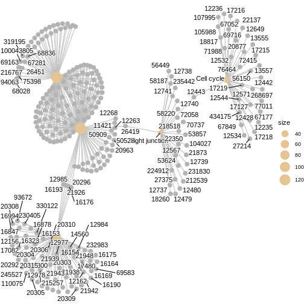

:::::::::::::::::::::::::::::::::::::: questions 

- How can we perform pathway analysis using KEGG?
- What insights can KEGG enrichment provide about differentially expressed genes

::::::::::::::::::::::::::::::::::::::::::::::::

::::::::::::::::::::::::::::::::::::: objectives

- Learn how to run KEGG over-representation and GSEA-style analysis in R.
- Understand how to interpret pathway-level results.
- Generate and visualise KEGG pathway figures.

::::::::::::::::::::::::::::::::::::::::::::::::


## Introduction
The KEGG (Kyoto Encyclopedia of Genes and Genomes) database links genes to curated biological pathways, offering a powerful foundation for understanding cellular functions at a systems level and making meaningful biological interpretations. `clusterProfiler` allows us to access KEGG and apply both ORA (using `enrichKEGG` function) and GSEA (using `gseKEGG` function) to extract pathway-level insights from our RNA-seq data.

## KEGG analysis

Before running enrichment, we need to confirm the correct KEGG organism code for mouse (`mmu`).
You can verify by searching:


``` r
kegg_organism <- "mmu"

search_kegg_organism(kegg_organism, by='kegg_code')
```

``` output
     kegg_code               scientific_name                   common_name
29        mmur            Microcebus murinus              gray mouse lemur
34         mmu                  Mus musculus                   house mouse
9090      mmuc Mycolicibacterium mucogenicum Mycolicibacterium mucogenicum
```

## Over-representation analysis with `enrichKEGG`
To run ORA using KEGG database, we need to specify the gene list, KEGG organism code and p-value cut-off. In this example, we take the top 500 genes from the ranked gene list `debasal_genelist`, specify the organism code `mmu` (defined as `kegg_organism) and use 0.05 as the p-value cut-off.

We can use `head()` function to briefly inspect the results of `enrichKEGG`.


``` r
kk <- enrichKEGG(gene         = names(debasal_genelist)[1:500],
                 organism     = kegg_organism,
                 pvalueCutoff = 0.05)
```

``` output
Reading KEGG annotation online: "https://rest.kegg.jp/link/mmu/pathway"...
```

``` output
Reading KEGG annotation online: "https://rest.kegg.jp/list/pathway/mmu"...
```

``` r
head(kk)
```

``` output
                                     category
mmu04110                   Cellular Processes
mmu04060 Environmental Information Processing
mmu05323                       Human Diseases
mmu04061 Environmental Information Processing
mmu04062                   Organismal Systems
mmu04914                   Organismal Systems
                                 subcategory       ID
mmu04110               Cell growth and death mmu04110
mmu04060 Signaling molecules and interaction mmu04060
mmu05323                      Immune disease mmu05323
mmu04061 Signaling molecules and interaction mmu04061
mmu04062                       Immune system mmu04062
mmu04914                    Endocrine system mmu04914
                                                           Description
mmu04110                                                    Cell cycle
mmu04060                        Cytokine-cytokine receptor interaction
mmu05323                                          Rheumatoid arthritis
mmu04061 Viral protein interaction with cytokine and cytokine receptor
mmu04062                                   Chemokine signaling pathway
mmu04914                       Progesterone-mediated oocyte maturation
         GeneRatio   BgRatio RichFactor FoldEnrichment   zScore       pvalue
mmu04110    19/247 157/10644 0.12101911       5.215091 8.200826 3.563172e-09
mmu04060    24/247 294/10644 0.08163265       3.517806 6.747644 8.088296e-08
mmu05323    13/247  87/10644 0.14942529       6.439201 7.851470 9.190595e-08
mmu04061    12/247  95/10644 0.12631579       5.443341 6.704900 1.853385e-06
mmu04062    16/247 194/10644 0.08247423       3.554072 5.533530 1.118165e-05
mmu04914    10/247  93/10644 0.10752688       4.633669 5.424584 5.627105e-05
             p.adjust       qvalue
mmu04110 9.976881e-07 8.026513e-07
mmu04060 8.577889e-06 6.901008e-06
mmu05323 8.577889e-06 6.901008e-06
mmu04061 1.297369e-04 1.043748e-04
mmu04062 6.261723e-04 5.037627e-04
mmu04914 2.468240e-03 1.985727e-03
                                                                                                                                                     geneID
mmu04110                               20877/434175/12235/77011/12236/76464/17218/12534/71988/268697/12428/17216/67849/17215/18817/17219/67052/105988/12532
mmu04060 12978/16878/77125/20311/29820/20308/20297/20305/12977/21948/17082/16182/232983/21942/18829/21926/20310/20309/16181/330122/14563/20296/12985/230405
mmu05323                                                                    110935/20311/20297/12977/14960/21926/14961/15001/68775/20310/330122/22339/20296
mmu04061                                                                           12978/20311/20308/20297/20305/12977/16182/18829/21926/20310/330122/20296
mmu04062                                                  22324/20311/20308/20297/20305/15162/18829/18751/432530/20310/20309/94176/330122/11513/18796/20296
mmu04914                                                                                    434175/12235/110033/12534/268697/432530/12428/18817/11513/12532
         Count
mmu04110    19
mmu04060    24
mmu05323    13
mmu04061    12
mmu04062    16
mmu04914    10
```

## GSEA-style KEGG enrichment with `gseKEGG`
Similar to previous enrichment analysis with GO database, we can also perform a GSEA-style enrichment using the KEGG database. To do so, we use the `gseKEGG` and specify the entire ranked gene list (`debasal_genelist`) rather than an arbitrary cutoff. In this example, we test KEGG pathways between 3 and 800 genes using 10,000 permutations and NCBI Gene IDs. Results are filtered using a p-value cut-off of 0.05.

``` r
kk2 <- gseKEGG(geneList     = debasal_genelist,
               organism     = kegg_organism,
               nPerm        = 10000,
               minGSSize    = 3,
               maxGSSize    = 800,
               pvalueCutoff = 0.05,
               pAdjustMethod = "none",
               keyType       = "ncbi-geneid")
```

``` output
Reading KEGG annotation online: "https://rest.kegg.jp/conv/ncbi-geneid/mmu"...
```

``` output
using 'fgsea' for GSEA analysis, please cite Korotkevich et al (2019).
```

``` output
preparing geneSet collections...
```

``` output
GSEA analysis...
```

``` warning
Warning in .GSEA(geneList = geneList, exponent = exponent, minGSSize =
minGSSize, : We do not recommend using nPerm parameter incurrent and future
releases
```

``` warning
Warning in fgsea(pathways = geneSets, stats = geneList, nperm = nPerm, minSize
= minGSSize, : You are trying to run fgseaSimple. It is recommended to use
fgseaMultilevel. To run fgseaMultilevel, you need to remove the nperm argument
in the fgsea function call.
```

``` warning
Warning in preparePathwaysAndStats(pathways, stats, minSize, maxSize, gseaParam, : There are ties in the preranked stats (0.98% of the list).
The order of those tied genes will be arbitrary, which may produce unexpected results.
```

``` output
leading edge analysis...
```

``` output
done...
```
## Visualising enriched pathways
### Dotplot
Before we look at individual pathways in detail, we can visualise the overall enrichment results using `dotplot()`.  
This dotplot summarises which KEGG pathways are enriched, how many genes contribute to each pathway, and how significant each one is.

``` r
dotplot(kk2, showCategory = 10, title = "Enriched Pathways" , split=".sign") + facet_grid(.~.sign)
```


### Similarity-based network plots
Next, we can explore how the enriched pathways relate to one another.  
The enrichment map groups pathways that share many genes, helping us see broader biological themes rather than isolated pathways.
In this case, `pairwise_termsim()` function calculates the similarity between enriched KEGG pathways and produces a similarity matrix that quantifies their relationship. The `emapplot()`generates an enrichment map using the similarity matrix produced, visualising the enriched pathways as a network with nodes representing pathways and edges reflecting their similarity.


``` r
kk3 <- pairwise_termsim(kk2)

emapplot(kk3)
```

``` warning
Warning: Using `size` aesthetic for lines was deprecated in ggplot2 3.4.0.
ℹ Please use `linewidth` instead.
ℹ The deprecated feature was likely used in the ggtangle package.
  Please report the issue to the authors.
This warning is displayed once every 8 hours.
Call `lifecycle::last_lifecycle_warnings()` to see where this warning was
generated.
```


We can also use `cnetplot()` to understand which genes drive these enriched pathways. This plot links genes to pathways they belong to and highlights genes that appear in multiple pathways.


``` r
cnetplot(kk3, categorySize="pvalue")
```

``` warning
Warning: ggrepel: 160 unlabeled data points (too many overlaps). Consider
increasing max.overlaps
```


### Ridge plot
We can also inspect the distribution of enrichment scores across pathways with `ridgeplot()`. This shows how strongly and broadly each pathway is enriched across the ranked gene list using overlapping density curves. 


``` r
ridgeplot(kk3) + labs(x = "enrichment distribution")
```

``` error
Error in `ridgeplot.gseaResult()` at enrichplot/R/ridgeplot.R:6:15:
! The package "ggridges" is required for `ridgeplot()`.
```


``` r
head(kk3)
```

``` output
               ID                             Description setSize
mmu05171 mmu05171          Coronavirus disease - COVID-19     216
mmu03010 mmu03010                                Ribosome     188
mmu04060 mmu04060  Cytokine-cytokine receptor interaction     177
mmu04110 mmu04110                              Cell cycle     153
mmu04530 mmu04530                          Tight junction     147
mmu04080 mmu04080 Neuroactive ligand-receptor interaction     146
         enrichmentScore      NES       pvalue     p.adjust      qvalue rank
mmu05171       0.5006706 1.946263 0.0001153802 0.0001153802 0.003343085 3724
mmu03010       0.5814136 2.226791 0.0001177302 0.0001177302 0.003343085 4733
mmu04060       0.5334229 2.030917 0.0001182313 0.0001182313 0.003343085 2003
mmu04110       0.5682774 2.130646 0.0001213298 0.0001213298 0.003343085 1287
mmu04530       0.4668123 1.743425 0.0001218918 0.0001218918 0.003343085 2221
mmu04080       0.4495919 1.678626 0.0001219066 0.0001219066 0.003343085 2287
                           leading_edge
mmu05171 tags=59%, list=24%, signal=46%
mmu03010 tags=67%, list=30%, signal=48%
mmu04060 tags=36%, list=13%, signal=32%
mmu04110  tags=22%, list=8%, signal=21%
mmu04530 tags=18%, list=14%, signal=16%
mmu04080 tags=36%, list=14%, signal=31%
                                                                                                                                                                                                                                                                                                                                                                                                                                                                                                                                                                                                                                                                                                                                                                                                                                          core_enrichment
mmu05171 12266/12262/12260/12259/666501/21926/18751/12268/13058/15200/20296/12985/24088/16176/664969/50908/20344/317677/14962/17174/16785/56040/269261/667277/625018/20084/99571/19982/68436/20963/225215/22186/50528/78294/619883/16451/67186/67097/26419/20085/67671/16193/671641/20055/19951/11837/100503670/20115/27367/243302/100040416/20116/54217/27370/11421/50909/621697/100042335/76808/629595/20103/270106/268449/20088/19896/67025/68052/20090/75617/432725/20054/27050/54127/26961/67115/67891/67945/114641/22121/19946/20091/19899/20042/66489/100039532/100040298/100502825/16194/67427/66480/66481/15945/65019/19921/100043695/20068/432502/19988/19933/76846/21898/267019/665562/20102/20044/27207/100043813/670832/19981/19942/71586/19941/57294/66475/19944/66483/27176/57808/16898/22371/625281/20848/19934/110954/433745/12263/68193
mmu03010  666501/664969/16785/56040/269261/20084/56282/19982/66973/68436/225215/22186/78294/619883/67186/67097/20085/67671/671641/20055/19951/11837/100503670/20115/14694/68836/27367/243302/100040416/20116/54217/27370/621697/100042335/76808/629595/20103/270106/268449/20088/19896/67025/68052/20090/75617/432725/69163/20054/27050/54127/26961/67115/67891/67945/114641/22121/19946/20091/19899/20042/66489/59054/100039532/100040298/100502825/67427/60441/66480/66481/65019/19921/100043695/27397/20068/432502/118451/19988/19933/76846/267019/665562/79044/20102/20044/27207/100043813/78523/670832/19981/19942/66230/19941/57294/66475/19944/94063/66483/27176/57808/16898/625281/66258/19934/110954/433745/28028/68193/75398/67281/619547/319195/50529/26451/14109/19989/20104/64657/64655/68028/66407/20005/94065/216767/67308/19943/100043805
mmu04060                                                                                                                                                                                                                                                                                                                                                                                                                                          12978/16878/77125/20311/29820/20308/20297/20305/12977/21948/17082/16182/232983/21942/18829/21926/20310/20309/16181/330122/14563/20296/12985/230405/93672/20304/16176/12984/16153/14560/83430/16847/215257/20306/16994/16154/16164/16156/20303/16169/110075/12983/20292/16185/326623/21938/17480/19116/16190/20300/14825/16323/16175/320100/21939/12156/21943/18049/12162/245527/69583/20315/16193/13608
mmu04110                                                                                                                                                                                                                                                                                                                                                                                                                                                                                                                                                                                                                                  20877/434175/12235/77011/12236/76464/17218/12534/71988/268697/12428/17216/67849/17215/18817/17219/67052/105988/12532/107995/72415/22137/13555/12649/69716/12544/12442/67177/56150/12571/13557/12443/17127/27214
mmu04530                                                                                                                                                                                                                                                                                                                                                                                                                                                                                                                                                                                                                                                                          12740/18260/212539/12737/53624/218518/12739/12480/231830/27375/70737/58187/12479/72058/12443/235442/53857/12738/21873/22350/104027/26419/224912/56449/58220/12567/12741
mmu04080                                                                                                                                                                                                                                                                                                                                                                                                                                                                                                       12310/22044/12266/223780/19204/216643/15558/207911/14419/15559/381073/231602/13614/18619/65086/54140/12062/16336/17200/11555/11549/16847/239845/11535/53623/67405/20287/109648/20607/18441/18389/170483/18436/19116/11541/11550/11606/13618/21333/15552/193034/15465/12671/16995/11539/227717/18442/110637/381677/14062/14658/171530/11553
```

You can see the top pathways, you can get the top pathway ID with the ID column.


``` r
# There must be a function that gets the results -> not ideal code
kk3@result$ID[1]
```

``` output
[1] "mmu05171"
```

### KEGG Pathway Diagram
Finally, we can visualise gene expression changes directly onto a KEGG pathway diagram.  
`pathview` highlights which components of the pathway are up- or down-regulated in your enrichment analysis.


``` r
# Produce the native KEGG plot (PNG)
mmu_pathway <- pathview(gene.data=debasal_genelist, pathway.id=kk3@result$ID[1], species = kegg_organism)
```

These will produce these files in your working directory:

mmu05171.xml
mmu05171.pathview.png
mmu05171.png


{alt='Image of pathway'}


::::::::::::::::::::::::::::::::::::: keypoints 

- KEGG pathway analysis helps link DEGs to functional biological pathways.

- Both ORA (`enrichKEGG`) and GSEA-style (`gseKEGG`) methods provide complementary insights.

- `pathview` enables visual interpretation of pathway-level expression changes.

::::::::::::::::::::::::::::::::::::::::::::::::

